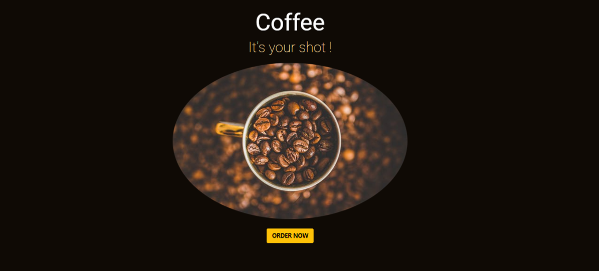

# CoffeeScript

This repository is my CoderHouse academy final project for the course JavaScript. It is a web page that briefly explains some forms of skateboarding.

## Description

I used for the creation of this website: Javascript, JQuery, HTML, CSS, SASS, Bootstrap and basic knowledge of SEO.

## Screenshots

### Home

### Customer Information

### Drinks selection

### Customer Order

## Project visualization

Use this link to enter and view the complete project https://felixmartinezcasadiego.github.io/CoffeeScrip/index.html